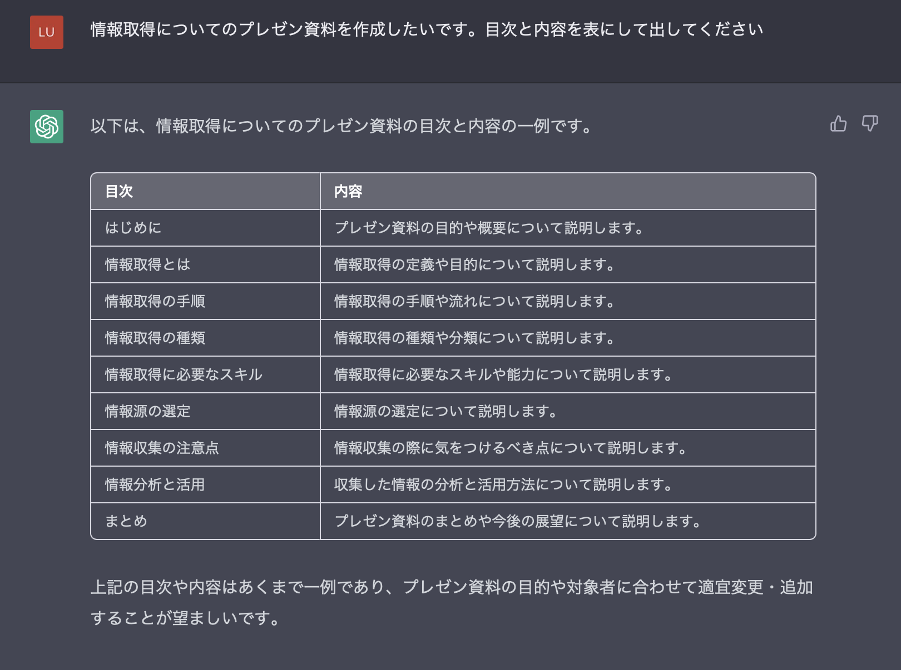

<!-- class: invert -->

# 情報取得について

---

# はじめに

これはみんながどうやって情報を取得しているのかなぁ
と思ったのがきっかけです。

自分は割と情報感度が高い方だと思うのでこの資料を公開することでみなさんの情報取得の一助となれば幸いです。

---

# 情報取得の手順や方法

情報を入手する方法は様々ですが、主に以下の手段があります。

- 本
- 新聞
- テレビ
- ラジオ
- インターネット
- 口伝

---

# 情報取得に必要なスキル

情報取得に必要なスキルには、以下のようなものがあります。

- 情報の取捨選択ができること
- 検索エンジンを使った情報収集能力
- 幅広い興味

---

# 情報源の選定

自分が実際に使っている情報源についてインターネットにフォーカスして紹介します。

---

# YouTube

最近はなんでもあるので最高。仕事系だと

- 桜井政博のゲーム作るには
- カカチャンネル
- わちょんのゆっくり IT
- ぷらぐら
- ラムダ技術部

---

個人的には、以下のチャンネルが好きです。

- オモコロチャンネル
- My Mechanics
- しもふりチューブ
- つるなか
- ゆる言語学ラジオ
- QuizKnock
- 株の買い時を考えるチャンネル

---

# Twitter

- 基本クラスタでまとめてリスト管理
  - `@naoya_ito`さんが最近は面白いかも
- セキュリティ系だと徳丸浩さん(`@ockeghem`)
- あとは知り合いのプログラマ
- 時間が溶けるのであんま見ない方がいいかも
- 最近はこれも RSS でやるようにした

---

# RSS

これが一番よく使ってます。ニュースサイトなどまとめて読めるので便利

## ニュース系

- Bloomberg
- BCN ＋ R

---

## 本系

- HONZ
- わたしが知らないスゴ本は、きっとあなたが読んでいる
- きんどう

---

## テックブログ

- GIGAZINE
- TechnoEdge
- 気になる、記になる...
- ソフトアンテナ
- AAPL Ch.
- iPhone Mania
- p2ptk\[.\]org
- CodeZine
- ラジオライフ.com

---

## 技術系ブログ

- POSTD \| ニジボックスが運営するエンジニアに向けたキュレーションメディア
  - この記事はみんな読んで欲しい
    - Blue. No! Yellow! : プログラミング言語の進歩史と生産性にまつわる問答 https://postd.cc/bluenoyellow/
- Publickey
- かちびと.net

---

## 海外系

- Verge
- TorrentFreak
- 9to5Mac
- Quartz

---

## 趣味系

- オモコロ
- mifdesign_antenna
- Ableton の最新エントリ

---

# 証券アプリ

- ロイター、フィスコあたりが無料で読める。
- 楽天証券だと日経新聞も一部分読めるのでよい
- 四季報も見れる

---

# Qiita, Zenn

- Qiita は若干質が落ちつつあるかも
- 毎日のランキングくらいはみてもいいかも
- 特定のキーワード + (Qiita | Zenn)を入れてググると欲しい情報があったりする

---

# GitHub

- 最近あまり見てないけど Trending は見てもいいかも（昔ランキング汚染されすぎてて見るのやめた記憶あり）

# StackOverflow

- 英語のサイトと思って逃げずにここ見るのが解決には一番かも

---

# Reddit

- ProgrammingHumor
- SoftwareGore
- UnixPorn
- MaybeMaybeMaybe

---

# はてなブックマーク

- テクノロジーは毎日みてる
- ある程度キュレーションされているといっていいので、技術系の情報はここ見るだけとかもありだと思います。
- 最近は企業 tech ブログをまとめたものができました。https://hatena.blog/dev

---

# Podcast

- Rebuild は聴くべき
- バイリンガルニュース
- yatteiki.fm
- backspace.fm
- Turing Complete FM
- ゆるコンピュータ科学ラジオ

---

# Netflix

- ドキュメンタリー系おすすめ
- 「ビルゲイツの頭の中」とか

# IMDb

- 映画、ドラマの評価をみたいんだったらこのサイトがオススメ

---

# 情報の活用方法

情報を取得するだけでは意味がありません。取得した情報を活用することが重要です。以下は情報を活用するための方法の例です。

- ブログや SNS で情報共有する
- 情報を整理してまとめる
- プレゼン資料の作成
- 情報を基に自分なりの意見を形成する

（この文章は ChatGPT を使って添削されています。）

---

# 情報の品質チェック方法

インターネット上には正確で信頼性の高い情報もあれば、誤った情報や偽情報も存在します。情報の品質を確認するためには、以下の方法があります。

- 情報の出所を確認する
- 複数の情報源から情報を収集する
- 情報を鵜呑みにしないこと
- 一次ソースや論理的に問題ないか、反証を考えてみる

（この文章は ChatGPT を使って添削されています。）

---

# まとめ

情報収集は自分自身の能力や人生において非常に重要なスキルの 1 つです。是非、この資料を参考にして、より効果的な情報収集を行ってください。
（この文章は ChatGPT を使って添削されています。）

---

# おまけ

今回の資料の作り方

1. まず、ChatGPT くんにアウトラインを描いてもらいます。

---

---

2. アウトラインに従って Markdown に書き出します。

3. 肉付けを行います。

4. Marp(https://github.com/marp-team/marpit)のフォーマットにします。

5. PDF に出力して終わり。
